# Abstract

The Azuki TCG is a strategy card game with mechanics similar to the One Piece TCG and Magic Commander. The Azuki TCG introduces some unique challenges for AI models such as, long time horizons, imperfect information, and complex strategies. In this paper, we will explore iterating upon existing research such as OpenAI's OpenAI Five and Bytedance's Hearthstone agents. We've iterated upon these existing models to experiment with using language embedding inputs to train a more general model that can utilize cards that aren't in the training data. We've also experimented with improving training speeds by experimenting with GPU based simulations and utilizing PufferLib and distributed training systems.

# Iteration 1

## Observation Space

The v2 model does not observe rendered pixels. At each decision point, each player receives a semantic observation derived from the current game state. This avoids the cost of screen rendering while still giving the model the strategic information that would normally be visible through the board, hand, discard piles, resource area, pending prompts, and legal action UI.

The observation is always perspective-relative: player features describe the acting model's side, and opponent features describe the other side. Hidden information is preserved for the actor. The actor receives full detail for its own hand and public board zones, but only count-level information for the opponent's hand and deck. During training, an optional privileged value function can also receive hidden opponent hand and deck information; this auxiliary information is not included in the actor's policy input.

Cards are first represented by stable identifiers, but the v2 policy does not treat those identifiers as the primary semantic card input. Instead, each identifier is used as a deterministic lookup key into a generated metadata table. That lookup provides card type, element, printed IKZ cost, base attack, base health, gate points, ability timing, optional-ability flags, keyword multi-hot features, and OpenAI text embeddings for the card name, effect text, and subtypes. This is the main difference from the earlier static-card model: the model learns from metadata and text-derived features rather than from a standalone learned embedding per known card.

The table below keeps the gameplay-oriented organization of the observation, but reports the processed features used by the neural policy rather than the raw engine record. During training, every observed card reference is expanded through a generated metadata and text-embedding lookup. Zone and entity encoders then turn the player and opponent groups into 64-dimensional vectors. The actor receives a 960-dimensional state vector made from fifteen such vectors, plus a 224 x 64 action-reference matrix used by the action decoder.

<table class="obs-grid">
  <tr>
    <td>
      <table class="obs-space">
        <tr><th>Card metadata lookup</th><th>48</th></tr>
        <tr class="obs-cat"><td>name embedding: 1536 -> 16</td><td>16</td></tr>
        <tr class="obs-cat"><td>effect embedding: 1536 -> 24</td><td>24</td></tr>
        <tr class="obs-cat"><td>subtype embedding: 1536 -> 16</td><td>16</td></tr>
        <tr><td>keyword multi-hot: 8 -> 16</td><td>16</td></tr>
        <tr class="obs-cat"><td>card type / element / timing</td><td>12</td></tr>
        <tr><td>present, cost, base stats, ability flags</td><td>7</td></tr>
        <tr><td>metadata projector: 91 -> 48</td><td>48</td></tr>
      </table>
      <table class="obs-space">
        <tr><th>Global game data</th><th>64</th></tr>
        <tr class="obs-cat"><td>game phase + ability phase</td><td>8</td></tr>
        <tr><td>source card metadata embedding</td><td>48</td></tr>
        <tr><td>ability prompt scalars</td><td>9</td></tr>
        <tr><td>zone counts and IKZ-token flags</td><td>9</td></tr>
        <tr><td>combat context projection</td><td>64</td></tr>
        <tr><td>recent self/opponent actions</td><td>64</td></tr>
        <tr><td>global fusion output</td><td>64</td></tr>
      </table>
      <table class="obs-space">
        <tr><th>Common entity encoders</th><th>64</th></tr>
        <tr><td>hand/discard card: metadata + zone index + printed stats</td><td>64</td></tr>
        <tr><td>board entity: metadata + slot + weapons + live state</td><td>64</td></tr>
        <tr><td>IKZ card: metadata + slot + tap state</td><td>64</td></tr>
        <tr><td>leader: metadata + weapons + live state</td><td>64</td></tr>
        <tr><td>gate: metadata + tap state</td><td>64</td></tr>
        <tr><td>set pooling: masked max over visible slots</td><td>64</td></tr>
      </table>
    </td>
    <td>
      <table class="obs-space">
        <tr><th>Player zones</th><th>64 each</th></tr>
        <tr><td>hand (30): pooled card-token set</td><td>64</td></tr>
        <tr><td>discard (50): pooled card-token set</td><td>64</td></tr>
        <tr><td>garden (5): pooled board-entity set</td><td>64</td></tr>
        <tr><td>alley (5): pooled board-entity set</td><td>64</td></tr>
        <tr><td>selection zone (50): pooled prompt choices</td><td>64</td></tr>
        <tr><td>IKZ area (10): pooled resource cards</td><td>64</td></tr>
        <tr><td>leader singleton</td><td>64</td></tr>
        <tr><td>gate singleton</td><td>64</td></tr>
      </table>
      <table class="obs-space">
        <tr><th>Opponent zones</th><th>64 each</th></tr>
        <tr><td>discard (50): pooled public discard set</td><td>64</td></tr>
        <tr><td>garden (5): pooled board-entity set</td><td>64</td></tr>
        <tr><td>alley (5): pooled board-entity set</td><td>64</td></tr>
        <tr><td>IKZ area (10): pooled public resources</td><td>64</td></tr>
        <tr><td>leader singleton</td><td>64</td></tr>
        <tr><td>gate singleton</td><td>64</td></tr>
        <tr><td>hand and deck hidden; counts only</td><td>-</td></tr>
      </table>
      <table class="obs-space">
        <tr><th>Flattened actor vector</th><th>960</th></tr>
        <tr><td>player pooled groups</td><td>8 x 64</td></tr>
        <tr><td>opponent pooled groups</td><td>6 x 64</td></tr>
        <tr><td>global fused embedding</td><td>1 x 64</td></tr>
        <tr><td>total input to recurrent core</td><td>15 x 64</td></tr>
      </table>
    </td>
    <td>
      <table class="obs-space">
        <tr><th>Action reference matrix</th><th>224 x 64</th></tr>
        <tr><td>player hand / discard / opponent discard</td><td>130</td></tr>
        <tr><td>player garden / alley / selection</td><td>60</td></tr>
        <tr><td>opponent garden / alley</td><td>10</td></tr>
        <tr><td>player IKZ / opponent IKZ</td><td>20</td></tr>
        <tr><td>leaders and gates</td><td>4</td></tr>
        <tr><td>per-reference embedding width</td><td>64</td></tr>
      </table>
      <table class="obs-space">
        <tr><th>Legal action candidates</th><th>64 each</th></tr>
        <tr class="obs-cat"><td>candidate tuple: primary + 3 args</td><td>4</td></tr>
        <tr><td>primary action embedding</td><td>64</td></tr>
        <tr class="obs-cat"><td>subaction index embeddings</td><td>24</td></tr>
        <tr class="obs-cat"><td>argument-kind embeddings</td><td>24</td></tr>
        <tr><td>semantic references from matrix</td><td>192</td></tr>
        <tr><td>normalized args + ref-valid flags</td><td>6</td></tr>
        <tr><td>candidate projector: 310 -> 64</td><td>64</td></tr>
        <tr><td>max legal candidates scored</td><td>1,024</td></tr>
      </table>
      <table class="obs-space">
        <tr><th>Policy core and critic</th><th>var.</th></tr>
        <tr><td>LSTM input: flattened actor vector</td><td>960</td></tr>
        <tr><td>LSTM hidden state</td><td>4096</td></tr>
        <tr><td>legal-action query projection</td><td>64</td></tr>
        <tr><td>optional privileged critic: opponent hand + both decks</td><td>192</td></tr>
      </table>
    </td>
  </tr>
</table>

Table 1: Processed v2 model input, organized by game information before flattening. Shaded rows are categorical or text-embedding-derived features before projection. Raw card identifiers are only lookup keys; after lookup, cards enter the model through the projected metadata representation.

The default v2 configuration uses the legal-action scorer: each legal action candidate is converted into a 64-dimensional action embedding using the action type, argument-kind embeddings, and semantic references gathered from the 224-token action-reference matrix. The LSTM output is projected to a 64-dimensional query and scored against these candidates. This means the model's effective input is the processed observation vector and reference matrix, while raw identifiers and masks serve as lookup and legality scaffolding.

## Reward Weights

The PPO agent is optimized to win the match, but a terminal win/loss signal is too sparse for the length and branching factor of Azuki games. We therefore train with a shaped reward that is modeled loosely after potential-based shaping: each non-terminal step compares the acting player's current board-state potential to the previous potential, then gives the acting player the signed change and the opponent the negative of that value. The shaping is not a proof-preserving potential function because we add extra deltas, no-op penalties, time decay, truncation rewards, and optional annealing.

At each step the environment records a compact reward snapshot for both players: leader health ratio, total attack in Garden, untapped Garden entity count, and untapped IKZ count. Leader health is transformed before entering the main potential:

\[
H(x) = \frac{x + 1 - (1 - x)^4}{2}
\]

where \(x\) is the leader's fraction of full health. The per-player potential is then:

\[
\phi =
\tanh\left(
4.0\,e\_{\text{leader}}

- 0.7\,e\_{\text{garden attack}}
- 0.15\,e\_{\text{untapped garden}}
- 0.15\,e\_{\text{untapped IKZ}}
  \right)
  \]

\[
\begin{aligned}
e*{\text{leader}} &= H(\text{self}) - H(\text{opponent}) \\
e*{\text{garden attack}} &=
\frac{\text{garden attack}_{\text{self}} - \text{garden attack}_{\text{opponent}}}{10} \\
e*{\text{untapped garden}} &=
\frac{\text{untapped garden}*{\text{self}} - \text{untapped garden}_{\text{opponent}}}{5} \\
e_{\text{untapped IKZ}} &=
\frac{\text{untapped IKZ}_{\text{self}} - \text{untapped IKZ}_{\text{opponent}}}{10}
\end{aligned}
\]

This makes the shaped signal reward states with a healthier leader, more threatening Garden board, and more available resources, while \(\tanh\) bounds large board advantages.

For a normal non-terminal action, the acting player's base shaped reward is:

\[
r*{\text{base}} =
w_t(\phi_t - \phi*{t-1})

- \Delta\_{\text{leader}}
- \Delta\_{\text{board}}

* p\_{\text{noop}}
  \]

\[
\begin{aligned}
r*{\text{actor}} &= s*{\text{shape}}\,r*{\text{base}} \\
r*{\text{opponent}} &= -r\_{\text{actor}}
\end{aligned}
\]

Normal step rewards are therefore zero-sum. \(\Delta*{\text{leader}}\) is an additional raw leader-health edge change with weight \(1.25\). \(\Delta*{\text{board}}\) is an additional Garden attack edge change with weight \(0.35\). If the selected action is `NOOP` while other legal actions were available, the acting player receives a \(0.02\) penalty. \(w_t\) starts at \(1.0\) each episode and is multiplied by \(0.95\) after every shaped step, so earlier progress is weighted slightly more heavily than late-game bookkeeping.

<table class="reward-weights">
  <tr>
    <th class="rw-name">Name</th>
    <th class="rw-reward">Reward</th>
    <th class="rw-players">Players</th>
    <th class="rw-description">Description</th>
  </tr>
  <tr>
    <td class="rw-name">Win</td>
    <td class="rw-reward">5</td>
    <td class="rw-players">Winner</td>
    <td class="rw-description">Terminal game-over reward. The loser receives -5; draws receive 0 for both seats.</td>
  </tr>
  <tr>
    <td class="rw-name">Leader HP Potential</td>
    <td class="rw-reward">4.0</td>
    <td class="rw-players">Zero-sum</td>
    <td class="rw-description">Uses the transformed leader health edge defined above.</td>
  </tr>
  <tr>
    <td class="rw-name">Garden Attack Potential</td>
    <td class="rw-reward">0.7</td>
    <td class="rw-players">Zero-sum</td>
    <td class="rw-description">Total Garden attack edge, normalized by a cap of 10 attack.</td>
  </tr>
  <tr>
    <td class="rw-name">Untapped Garden Potential</td>
    <td class="rw-reward">0.15</td>
    <td class="rw-players">Zero-sum</td>
    <td class="rw-description">Untapped Garden entity edge, normalized by a cap of 5 entities.</td>
  </tr>
  <tr>
    <td class="rw-name">Untapped IKZ Potential</td>
    <td class="rw-reward">0.15</td>
    <td class="rw-players">Zero-sum</td>
    <td class="rw-description">Untapped IKZ card edge, normalized by a cap of 10 cards.</td>
  </tr>
  <tr>
    <td class="rw-name">Time Decay</td>
    <td class="rw-reward">0.95</td>
    <td class="rw-players">Shaped</td>
    <td class="rw-description">The potential delta multiplier starts at 1.0 and is multiplied by this value after each shaped step.</td>
  </tr>
  <tr>
    <td class="rw-name">Leader HP Delta</td>
    <td class="rw-reward">1.25</td>
    <td class="rw-players">Zero-sum</td>
    <td class="rw-description">Additional raw leader-health edge change added to the shaped reward.</td>
  </tr>
  <tr>
    <td class="rw-name">Garden Attack Delta</td>
    <td class="rw-reward">0.35</td>
    <td class="rw-players">Zero-sum</td>
    <td class="rw-description">Additional Garden attack edge change, normalized by a cap of 10 attack.</td>
  </tr>
  <tr>
    <td class="rw-name">Avoidable NOOP</td>
    <td class="rw-reward">-0.02</td>
    <td class="rw-players">Acting</td>
    <td class="rw-description">Applied when the acting player selects NOOP while other legal actions are available; the opponent receives the opposite sign.</td>
  </tr>
  <tr>
    <td class="rw-name">Timeout Truncation</td>
    <td class="rw-reward">-0.35</td>
    <td class="rw-players">Both</td>
    <td class="rw-description">Applied to both players on episode timeout, in addition to truncation edge terms.</td>
  </tr>
  <tr>
    <td class="rw-name">Engine-Guard Truncation</td>
    <td class="rw-reward">-0.60</td>
    <td class="rw-players">Both</td>
    <td class="rw-description">Applied to both players for auto-tick or zero-legal-action truncation.</td>
  </tr>
  <tr>
    <td class="rw-name">Truncation Leader Edge</td>
    <td class="rw-reward">1.25</td>
    <td class="rw-players">Zero-sum</td>
    <td class="rw-description">Terminal-style leader-health edge used when an episode is truncated.</td>
  </tr>
  <tr>
    <td class="rw-name">Truncation Board Edge</td>
    <td class="rw-reward">0.45</td>
    <td class="rw-players">Zero-sum</td>
    <td class="rw-description">Terminal-style board edge used when an episode is truncated.</td>
  </tr>
</table>

Table 2: PPO reward weights used by the native training environment.

Terminal game-over rewards replace shaping on the final step:

\[
\begin{aligned}
r*{\text{winner}} &= +5.0 \\
r*{\text{loser}} &= -5.0 \\
r\_{\text{draw}} &= 0.0
\end{aligned}
\]

Truncated episodes use a separate terminal-style reward. The leader and board edge terms are zero-sum, but the timeout or engine-guard penalty is applied to both players to discourage policies that merely stall until truncation:

\[
\begin{aligned}
r*0 &= e*{\text{leader}} + e*{\text{board}} - p*{\text{truncation}} \\
r*1 &= -e*{\text{leader}} - e*{\text{board}} - p*{\text{truncation}}
\end{aligned}
\]

The trainer exposes terminal and shaped rewards separately in the step info as `azk_step_terminal_reward` and `azk_step_shaped_reward`, while the PPO rollout still stores their sum as the reward used for the main policy advantage. When split value heads are enabled, the critic learns separate terminal and shaped value targets and the policy value is their sum. This lets the critic model sparse win/loss outcomes separately from dense shaping without changing the reward that drives the clipped PPO policy objective.

Reward shaping can also be annealed with environment variables. When `AZK_REWARD_SHAPING_ANNEAL` is enabled, shaped rewards are multiplied by a scale that defaults to `1.0`, stays there for `2,000` completed episodes, then linearly ramps to `0.05` over `30,000` episodes. Terminal and truncation rewards are not affected by this shaping scale. The intent is to use dense feedback early, then let later training focus more heavily on winning rather than preserving every heuristic encoded in the shaping function.

## Neural Network Architecture

Figure 1 sketches the actual v2 observation encoder implemented in `python/src/policy/v2/tcg_policy.py`. The model expands card identifiers through the generated metadata table, encodes card zones with shared set processors and singleton projectors, concatenates fifteen 64-dimensional pooled groups into the 960-dimensional LSTM input, and separately preserves a 224 x 64 action-reference matrix for the actor head.

Figure 2 sketches the default v2 action head. The current configuration uses the legal-action scorer: each legal action row is embedded from its primary action, subaction indices, inferred argument kinds, semantic references from encoded zones, and validity scalars. The LSTM hidden state becomes a 64-dimensional query that scores each candidate with a dot product plus a learned candidate bias. The code still supports a factorized actor head, but that is an alternate path rather than the default charted path.

Editable diagram sources: [neural-network-architecture-rough.mmd](diagrams/neural-network-architecture-rough.mmd) and [action-head-rough.mmd](diagrams/action-head-rough.mmd).
